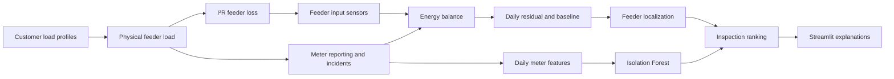

# Architecture

The transformer input equals three feeder inputs plus transformer core/copper loss. Each feeder input equals delivered customer and unmetered energy plus modeled line loss. The detector sees only feeder, transformer, meter, and inventory measurements. Ground truth is returned separately to the validation view.

The high-level boundary is important: feeder sensors can localize an unexplained load to a feeder, while meter trends can identify a suspect *meter behavior*. A bypass-type load with an otherwise normal meter has no unique customer signature here, so the system never claims customer-level localization for that scenario.
