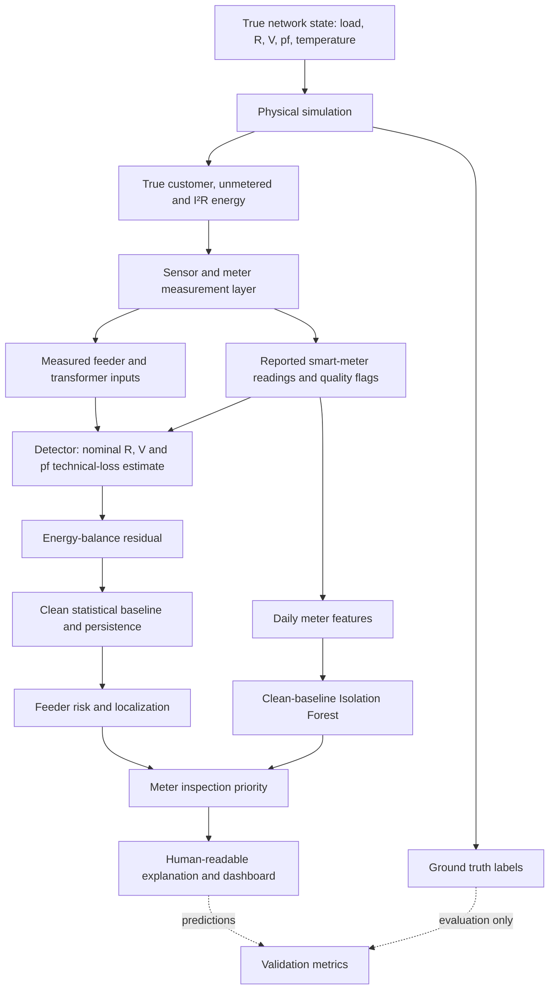

# Architecture

The detector reads only `Simulation.customers`, `meters`, `feeders`, `transformer`, and nominal config. The `physical_*` frames and `truth` frame are retained for energy-conservation tests and evaluation, and are never referenced in `detect()`.

Physical feeder input equals true customer load plus true unmetered load plus true feeder technical loss. Physical transformer input equals all true feeder inputs plus true transformer loss. Independent sensor noise changes the measured readings, not those conservation identities. Transformer residuals therefore vary under clean operation; they are presented as a system-level sanity check.

One feeder imbalance can identify the affected feeder. A bypass load with normal meter behavior cannot be assigned to a particular customer from these channels alone. Only a distinct meter pattern plus feeder context affects a customer's inspection priority.

